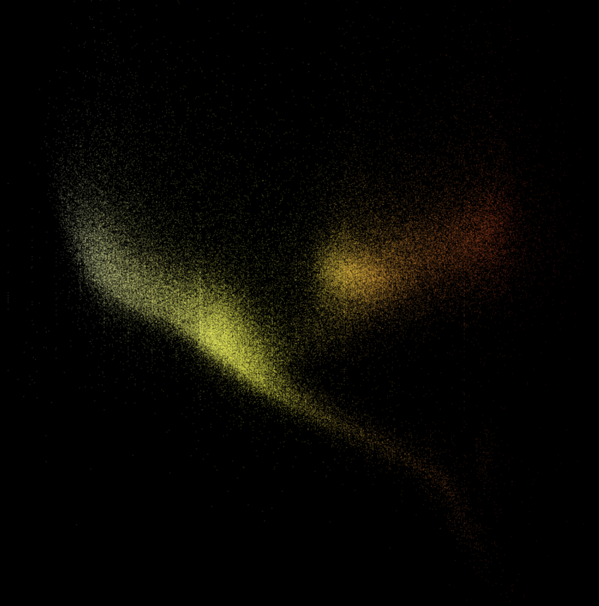
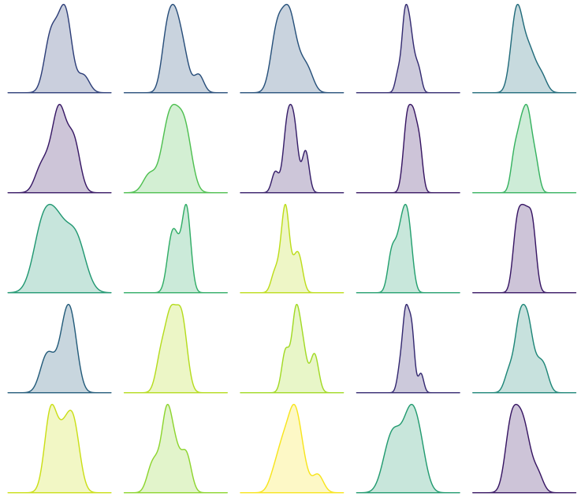
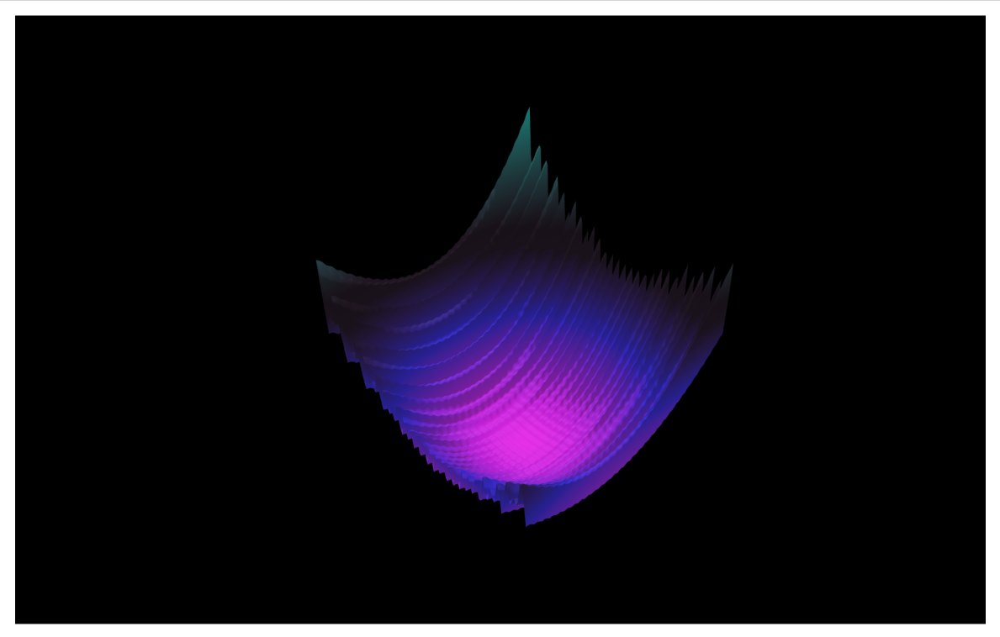
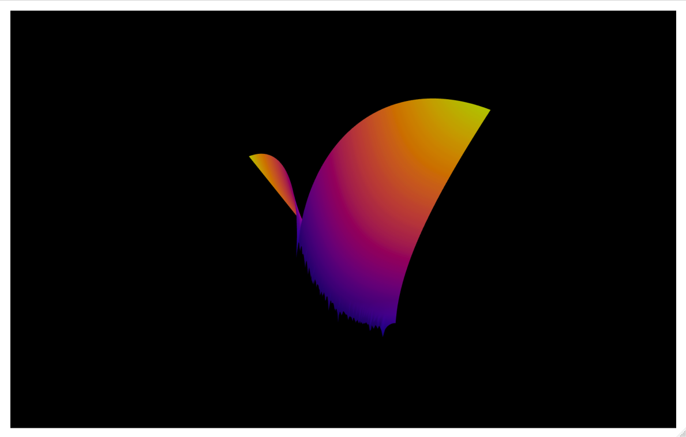
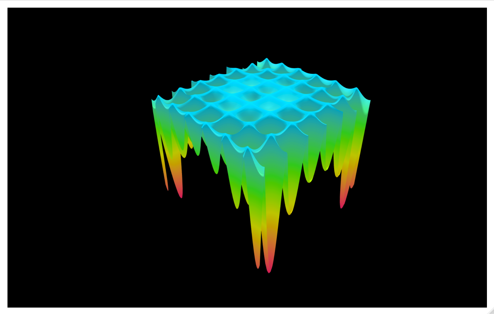
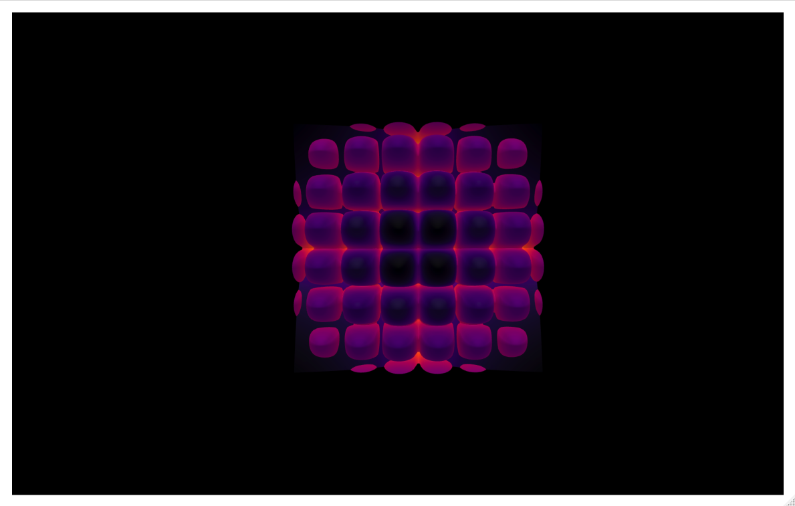

Visuals
=======

This repository is a collection of visual exercursions, accidents, statistical demos, and tangents.  Mostly done with ggplot2.

|   |   |   |   |
|:-:|:-:|:-:|:-:|
| |   |   |   |
|   |   |   |   |
|   |   |   |   
|   |   |   |   