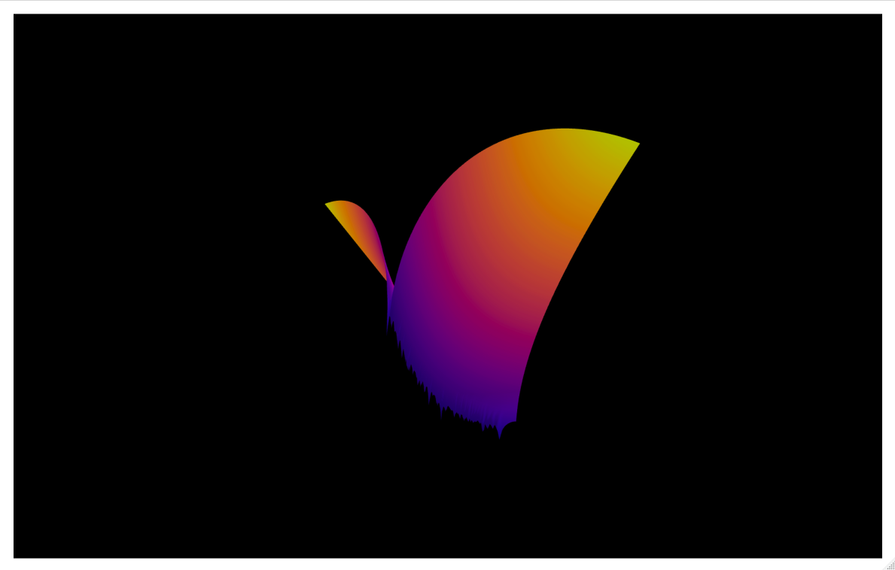

Various test functions for optimization, a.k.a. 'because they look cool'.  The files can be played with for individual demonstration, but there is a global function in `functions.R` that requires an x and y domain, the function you want to visualize, and a colorspace, as below.  These are taken from the Wikipedia page on [test functions for optimization](https://en.wikipedia.org/wiki/Test_functions_for_optimization).  I suggest you *not* use the jet and rainbow color schemes used there.

```r
optimvis(domain_x = c(-5, 5), 
         domain_y = c(-5, 5), 
         optimfun = levi, 
         col = NineteenEightyR::electronic_night())
```





