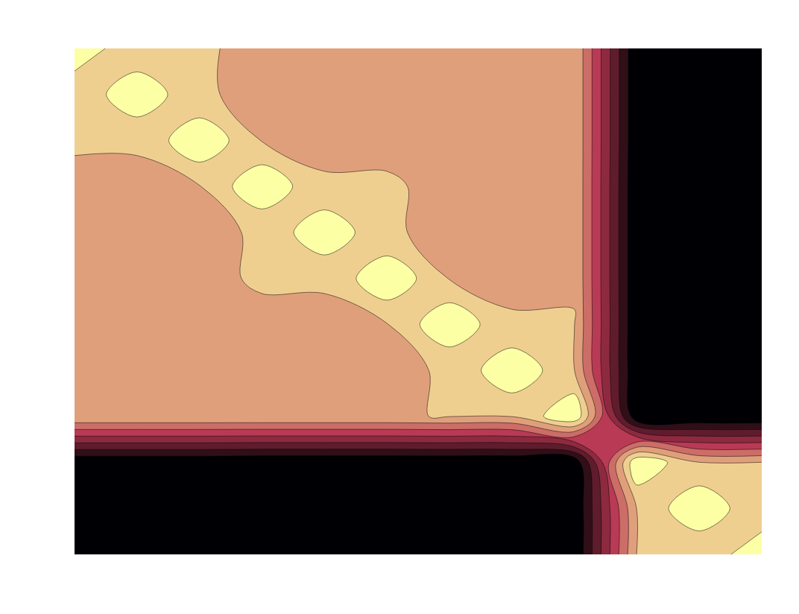
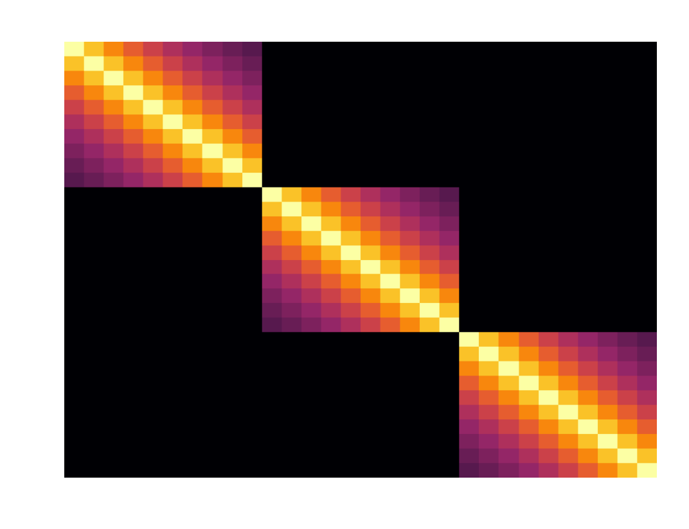
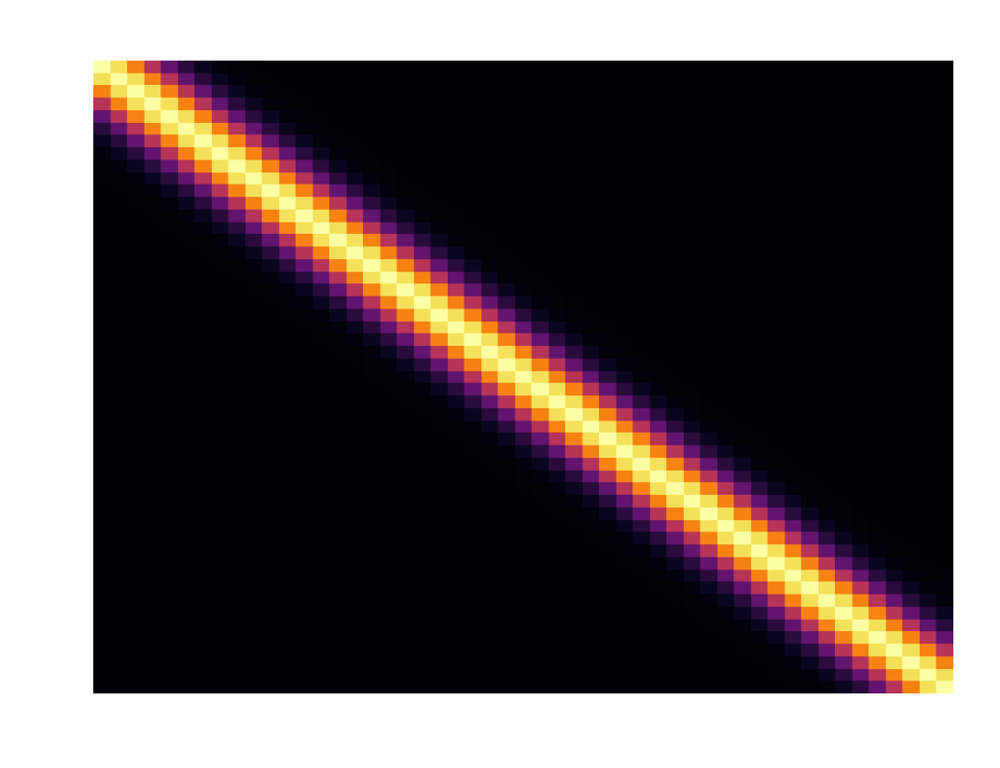
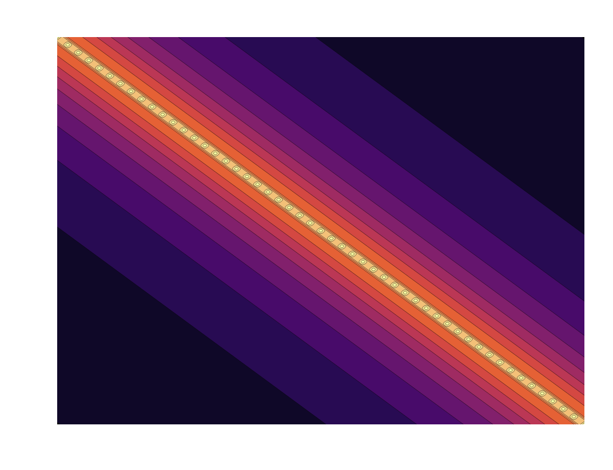
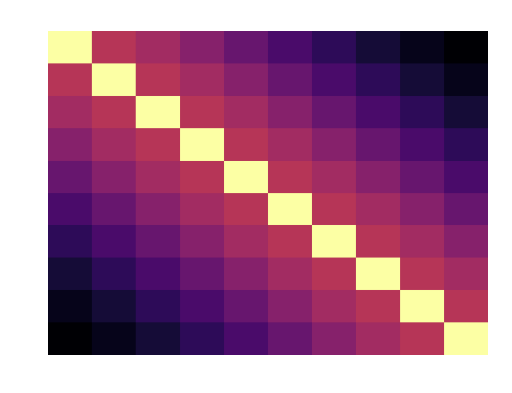
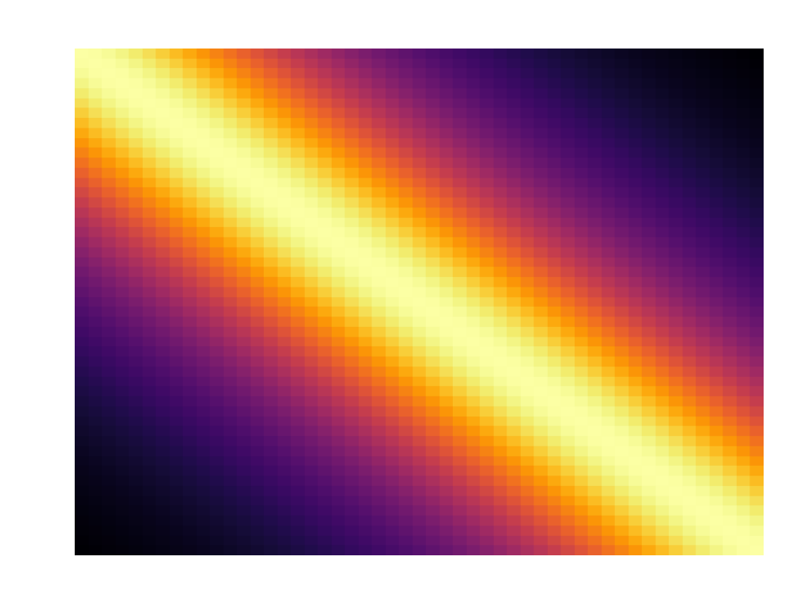
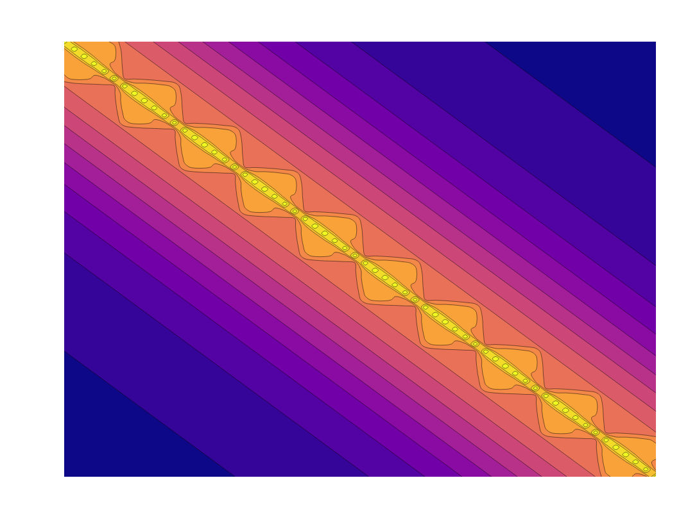

These are some visualizations of some covariance structures for random effects and gaussian process models.  By accident I found that plotly kind of does some unusual, but in my opinion quite nifty, things when using a contour plot to visualize a matrix.  The colorscales are from viridis.

### Mixed model covariance structures

- Standard random intercepts

- An additional random effect

- A 'nested' random effect

- Non-nested

  - Zoomed

- AR1 (also Toeplitz)

- As a heatmap

### Gaussian processes

- Squared Exponential Kernel

  - Different settings 

  

- Rational Quadratic

  - Zoomed in as a heatmap

  - Different settings
    

- A combination of covariance structures

